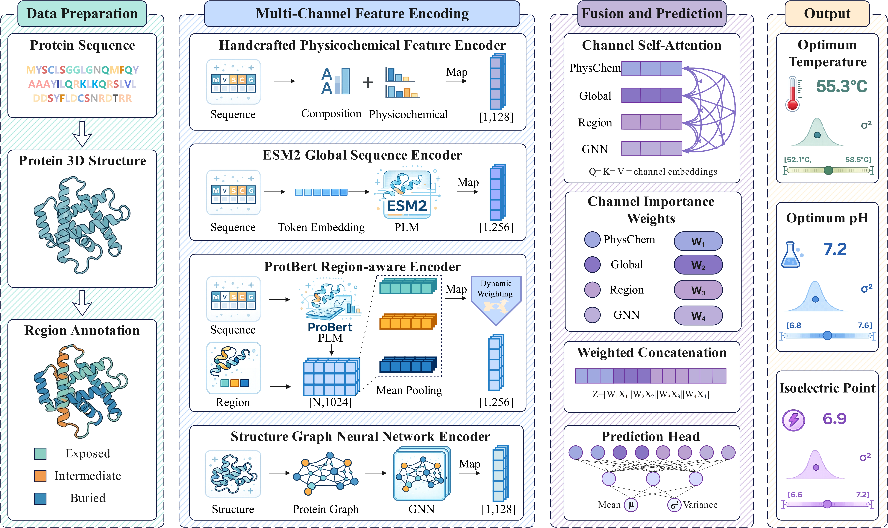

# EnzyProp

Structure-aware command-line toolkit for enzyme property prediction.

<p align="center">
  
</p>

EnzyProp predicts three enzyme properties from protein sequence and PDB
structure files:

- `topt`: optimal temperature
- `phopt`: optimal pH
- `pi`: isoelectric point

The package combines sequence representations, structure-derived information,
and three-class SASA region features, then writes compact CSV prediction
results for downstream analysis.

## Highlights

- Command-line interface for single-target and three-target batch prediction
- Supports `csv`, `xlsx`, and `xls` input tables
- Accepts a single PDB file or a folder of PDB structures
- Automatically computes SASA features when needed
- Includes training entrypoints driven by YAML config files

## Repository Structure

```text
EnzyProp/
|- enzyme_predictor/   # package source code
|- configs/            # training config examples
|- test/               # small example inputs
|- figure/             # README figures
|- models/             # checkpoint placeholder / download notes
|- README.md
|- INSTALL.md
|- pyproject.toml
|- requirements.txt
`- environment.yml
```

Runtime folders used by the package:

```text
models/    # put trained checkpoints here
hf_cache/  # HuggingFace cache for ESM2 / ProtBert
outputs/   # prediction outputs
```

Expected checkpoint names:

```text
models/
  topt_best_model.pt
  phopt_best_model.pt
  pi_best_model.pt
```

## Pretrained Weights and Base Models

This repository does not include large model files.

- `models/` stores the trained EnzyProp checkpoints for `topt`, `phopt`, and
  `pi`. These checkpoint files will be released separately and downloaded
  manually by users. See `models/README.md` for expected filenames and future
  release notes.
- `hf_cache/` is only a local cache directory for upstream HuggingFace base
  models such as ESM2 and ProtBert. It is not part of the source repository.
  On first use, these base models can be downloaded automatically by the
  package and cached locally.

## Installation

Recommended:

```bash
conda env create -f environment.yml
conda activate web_pre
```

Manual install:

```bash
conda create -n web_pre python=3.10 pip -y
conda activate web_pre
pip install -r requirements.txt
pip install -e .
```

Check the CLI:

```bash
enzyprop --help
```

## Input Format

The input table can be `.csv`, `.xlsx`, or `.xls`.

Minimum format:

```csv
id,sequence
Q2HWU5,WHKATVYQIYPKSFMDTNGDGIGDLKGITSKLDYLQKLGV...
```

Accepted ID columns:

```text
uniprotkb_ac, id, entry, protein_id, accession
```

Accepted sequence columns:

```text
sequence, seq, aa_seq
```

Optional target columns:

```text
topt, temp, tm, temperature
phopt, ph, ph_value
pi
```

For batch prediction, a typical folder layout is:

```text
test/
  query.csv
  PDB/
    Q2HWU5.pdb
    D9I0I9.pdb
```

## Quick Start

Predict one target:

```bash
enzyprop predict --target topt --input-csv F:\path\to\test\query.csv --out-dir outputs\topt --device cpu
```

Predict all three targets:

```bash
enzyprop predict-all --input-csv F:\path\to\test\query.csv --out-dir outputs\all --device cpu
```

Predict with a single PDB file:

```bash
enzyprop predict --target pi --input-csv F:\path\to\test\one.csv --pdb-file F:\path\to\test\PDB\Q2HWU5.pdb --out-dir outputs\pi --device cpu
```

Legacy aliases are still supported:

```text
temp -> topt
ph   -> phopt
```

## Training

Training is driven by YAML config files:

```bash
enzyprop train --config configs/topt_train.yaml
```

Example configs:

```text
configs/
  topt_train.yaml
  phopt_train.yaml
  pi_train.yaml
```

Typical config fields:

```yaml
target: topt
train_table: ../data/topt_train.csv
val_table: ../data/topt_val.csv
test_table: ../data/topt_test.csv
pdb_dir: ../data/PDB
out_dir: ../runs/topt

epochs: 40
batch_size: 4
loss_alpha_B: 0.15
lr_head: 1.0e-4
lr_backbone: 1.0e-5
```

Training outputs typically include:

```text
runs/topt/
  topt_best_model.pt
  train_log.csv
  val_predictions.csv
  test_predictions.csv
  metrics.json
  train_config_resolved.json
  sasa_three/
```

The best checkpoint can then be copied into `models/` for prediction.

## Output

Single-target prediction outputs:

```text
topt_result.csv
phopt_result.csv
pi_result.csv
```

Each single-target CSV contains:

```text
id,pred_mu,pred_var,lower95,upper95,uncertainty
```

The merged result from `predict-all` contains target-specific prediction,
variance, confidence interval, and uncertainty columns, for example:

```text
id,topt_pred,topt_variance,topt_lower95,topt_upper95,topt_uncertainty,...
```

Uncertainty labels:

- `low`: lower uncertainty, model is more confident
- `medium`: medium uncertainty
- `high`: higher uncertainty, model is less confident

## Default Paths

If omitted, EnzyProp uses:

```text
models dir:  ./models
HF cache:    ./hf_cache
PDB dir:     input_csv_folder/PDB
SASA dir:    temporary folder deleted after prediction
```

CUDA is used when available. Use `--device cpu` to force CPU inference.

## Notes

- PyTorch Geometric is required even for CPU inference because the trained
  checkpoints include the GNN channel.
- Model checkpoints and HuggingFace cache files are not included in this
  repository.
- The `test/` folder contains small example files for quick validation.
